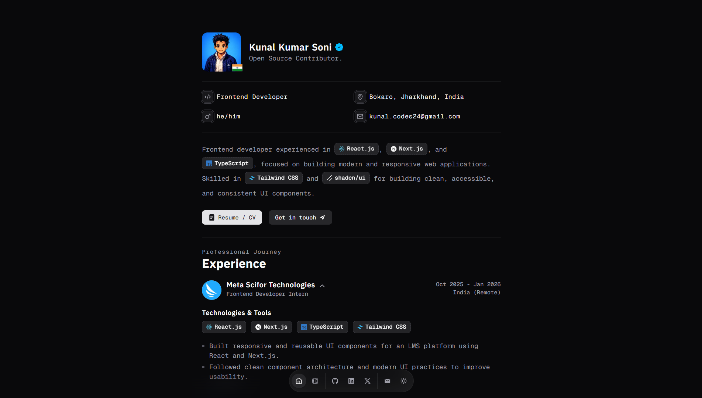

## Preview


## Tech & Features

- **Next.js**  
  Used for file-based routing, optimized performance, and SEO-friendly pages.

- **TypeScript**  
  Used to write type-safe code and reduce runtime errors.

- **Tailwind CSS**  
  Used for fast, utility-first styling and consistent design.

- **shadcn/ui & Magic UI**  
  Used to build accessible, customizable UI components and subtle animations on top of Tailwind CSS.

- **Resend**  
  Used for sending contact form emails via server actions with reliable email delivery.

---

## About

This premium portfolio is built to present my work and skills through a clean, performant, and scalable web experience.

---

## Getting Started

To run this project locally:

```bash
git clone https://github.com/Kunal-Kumar-Soni/portfolio_main.git
cd your-repo-name
npm install
npm run dev

---

## Author

**Kunal Kumar Soni**  

